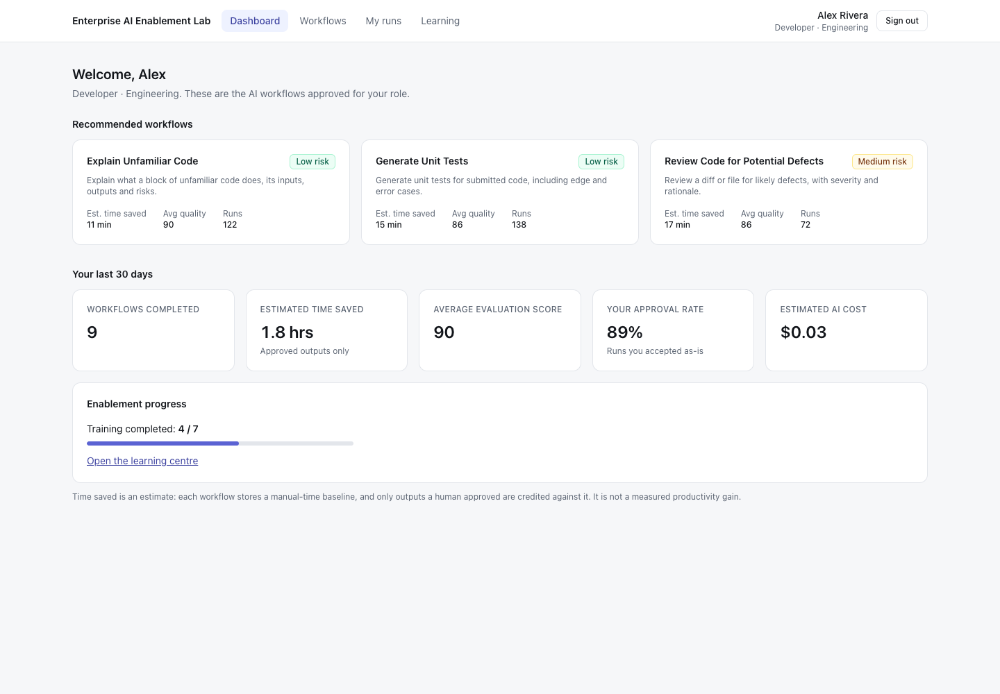
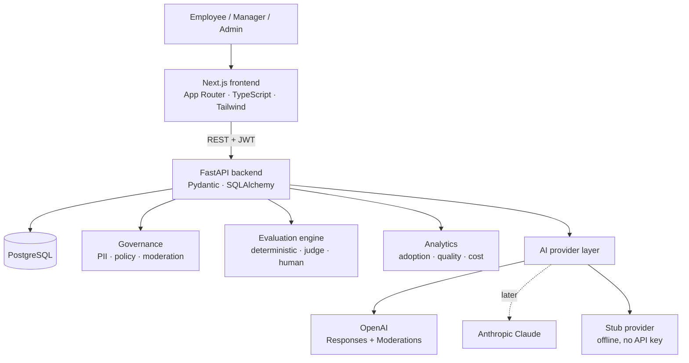
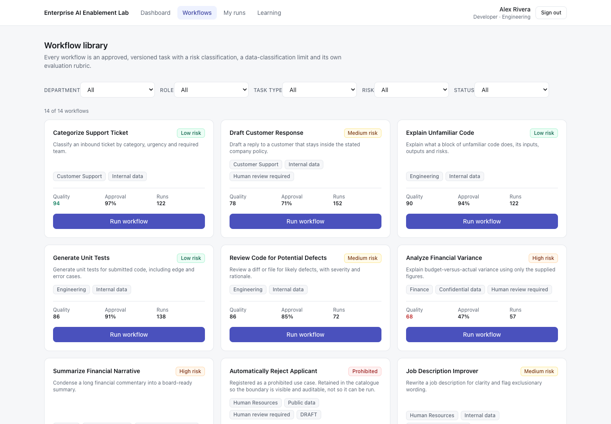
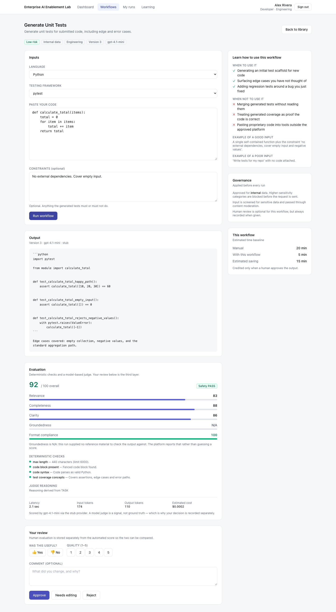
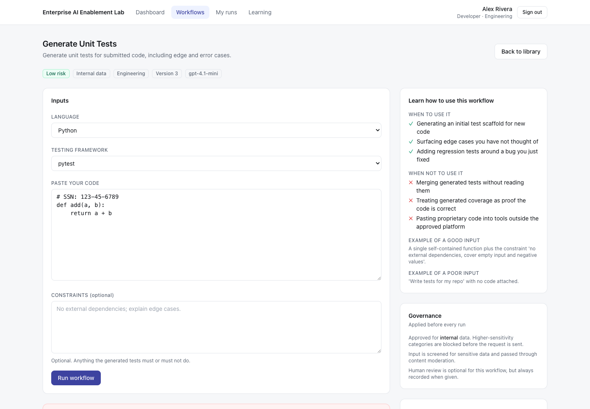
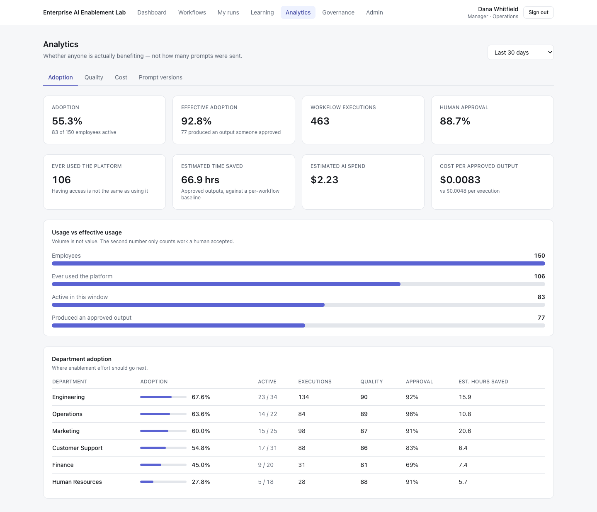
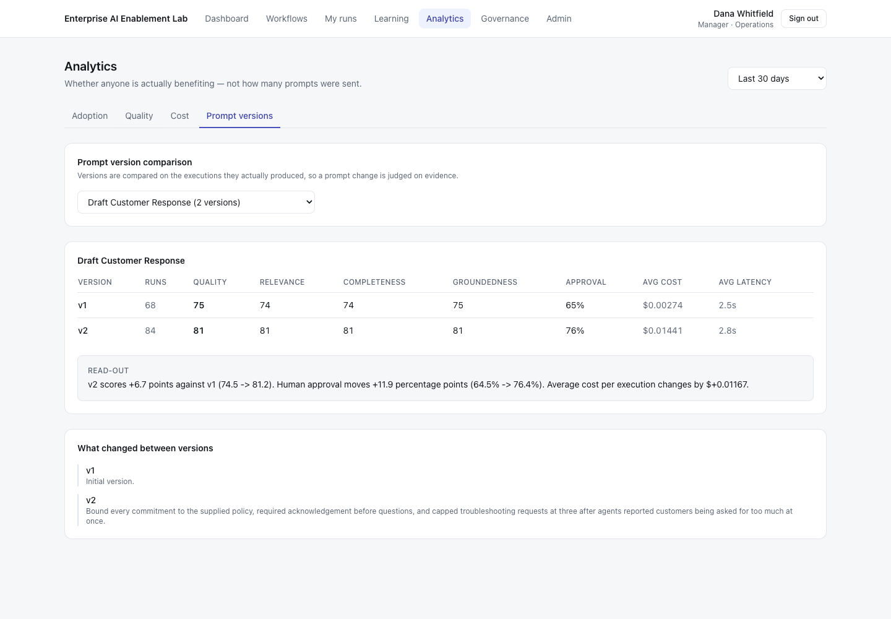
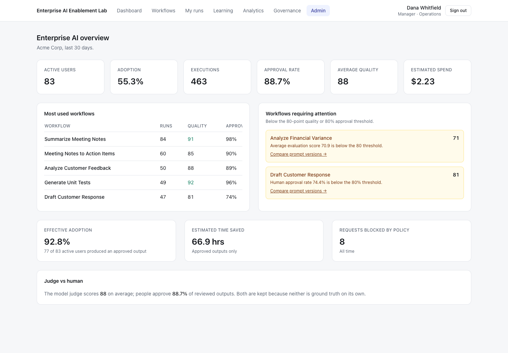
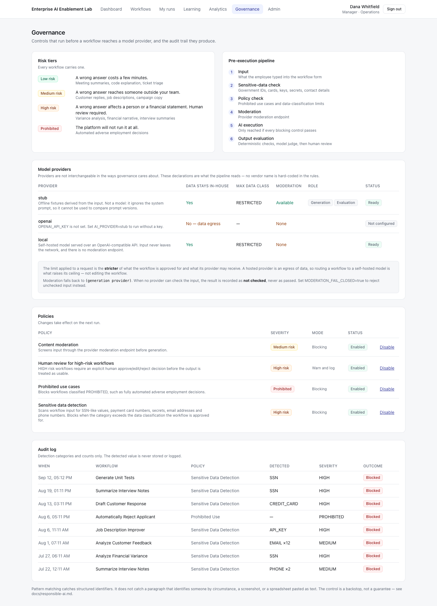

# Enterprise AI Enablement Lab

[](https://github.com/UsamahMoin/Enterprise-AI-Enablement-Evaluation-Platform/actions/workflows/backend.yml)
[](https://github.com/UsamahMoin/Enterprise-AI-Enablement-Evaluation-Platform/actions/workflows/frontend.yml)
[](LICENSE)

A reference implementation for governing, deploying, evaluating and measuring
AI-assisted workflows across an enterprise.

A prototype platform that helps organisations move from *buying AI licences* to
actually deploying measurable, governed AI workflows across teams.

---

## Why this exists

Companies increasingly give employees access to generative AI. Access alone does
not produce productive or responsible use. What is usually missing:

- employees do not know what to use AI for
- everyone writes prompts differently
- nobody knows whether the outputs are any good
- sensitive data gets pasted into prompts
- adoption cannot be measured
- there is no standardised workflow library
- nobody knows what it costs
- leadership cannot tell whether anything actually improved

This platform is built around those eight problems. The demo organisation, Acme
Corp, has 150 employees, six departments and a workflow catalogue — all
synthetic.



## What it does

**Role-based workflow library.** Employees do not get a blank chat box. They get
approved, versioned workflows for their role, each carrying a risk tier, a
data-classification limit, an input schema, an evaluation rubric, and
"when to use / when not to use" guidance.

**Three-layer evaluation.** Deterministic checks, an LLM-as-judge with
structured output, and human approve / edit / reject — kept separate on purpose,
because no layer is ground truth alone.

**Responsible-AI controls that run before generation.** Sensitive-data
detection, data-classification limits, prohibited use cases and moderation. A
blocked request never reaches the provider and its input is not stored.

**Prompt versioning with evidence.** Prompts are never overwritten. Each version
carries its own quality, approval, cost and latency history, plus a benchmark
runner that scores versions against a fixed case set.

**Adoption analytics that distinguish usage from value.** Licensed vs active vs
*effective* users, department breakdowns, estimated time saved credited only for
approved outputs, and cost per approved output.

**Enablement built in.** A learning centre and per-workflow guidance, because
assuming people know how to use generative AI well is how you get 28% adoption.

## Architecture



Nothing reaches a model provider until every enabled blocking control passes:

```
input → sensitive-data check → policy check → moderation → generation → evaluation → human review
```

Full detail, including the request sequence and what production would need that
this does not have: [`docs/architecture.md`](docs/architecture.md).

## Quickstart

```bash
git clone https://github.com/UsamahMoin/Enterprise-AI-Enablement-Evaluation-Platform.git
cd Enterprise-AI-Enablement-Evaluation-Platform
cp .env.example .env
docker compose up
```

| Service | URL |
|---|---|
| Frontend | http://localhost:3000 |
| API | http://localhost:8000 |
| Interactive API docs | http://localhost:8000/docs |
| PostgreSQL | localhost:5432 |

Migrations run and the demo dataset seeds automatically on first start.

**Demo accounts** — password `demo1234` for all of them:

| Account | Role | Sees |
|---|---|---|
| `employee@demo.com` | Employee | Own workflows and runs |
| `manager@demo.com` | Manager | Their department's aggregates |
| `admin@demo.com` | Admin | The whole organisation |

### Three ways to run inference

| `AI_PROVIDER` | What it is | Needs |
|---|---|---|
| `stub` *(default)* | Deterministic offline fixtures | nothing |
| `openai` | Hosted frontier models, Responses API | `OPENAI_API_KEY` |
| `local` | Self-hosted model over an OpenAI-compatible API | Ollama / LM Studio / llama.cpp |

The stub ignores the system prompt, so it cannot be used to compare prompt
versions — the benchmark runner says so explicitly when it is active.

```bash
# Self-hosted, e.g. Ollama
AI_PROVIDER=local
LOCAL_AI_BASE_URL=http://localhost:11434/v1
LOCAL_AI_MODEL=qwen3:8b
```

Generation and evaluation are routed **separately**, which is the interesting
part — see [Where the local provider earns its place](#where-the-local-provider-earns-its-place).

### Running without Docker

```bash
# Backend
cd backend
python -m venv .venv && source .venv/bin/activate
pip install -r requirements.txt
export DATABASE_URL="sqlite+aiosqlite:///./demo.db"   # or a PostgreSQL URL
alembic upgrade head
python -m app.seed
uvicorn app.main:app --reload

# Frontend
cd frontend
npm install
NEXT_PUBLIC_API_URL=http://127.0.0.1:8000 npm run dev
```

## Screens

### Workflow library

Filterable by department, role, task type, risk and status. Every card shows the
governance metadata and the workflow's real quality history.



### Execution and evaluation

The form is rendered from the workflow's stored input schema. The result carries
the output, the evaluation breakdown, token/latency/cost, and the human review
form — with automated and human judgement visibly separate.



### Governance blocking

Synthetic SSN in the input. Blocked before generation; the input is not stored,
and the audit record keeps the category and count, never the value.



### Adoption analytics



### Prompt version comparison



### Admin overview



## Where the local provider earns its place

Not because self-hosted models are better — on the structured-JSON output the
judge depends on, they are measurably worse. It earns its place for three
reasons that are specific to an enterprise platform.

**1. It is the structural answer to the problem this platform is about.**
Sensitive-data detection reduces accidental exposure; self-hosting removes the
egress entirely. So the data-classification ceiling is a property of the
*provider*, not just the workflow:

| Provider | Data stays in-house | Max classification | Moderation |
|---|---|---|---|
| `openai` | No — egress | CONFIDENTIAL | Available |
| `local` | Yes | RESTRICTED | **None** |

The limit applied to a request is the **stricter** of what the workflow is
approved for and what its provider may receive. Routing a workflow to a
self-hosted model is what raises its ceiling — not editing the workflow:

```
Workflow approved for RESTRICTED + hosted provider  → blocked at CONFIDENTIAL
Workflow approved for RESTRICTED + local provider   → permitted
Workflow approved for INTERNAL   + local provider   → still blocked at INTERNAL
```

Pin a version to a provider with `provider` on `POST /workflows/{id}/versions`.



**2. It lets the judge be independent of the generator.** `EVALUATION_PROVIDER`
is configured separately from `AI_PROVIDER`. A model grading its own output
shows self-preference bias; an independent judge is a cheap mitigation. It also
means sensitive output can be evaluated locally while generation stays hosted,
or the reverse.

**3. It proves the provider abstraction is real.** `LocalProvider` is not
`OpenAIProvider` with a different URL: it speaks Chat Completions rather than
the Responses API, requests `json_object` rather than strict `json_schema`
because small models comply with the looser form far more reliably, and has no
moderation endpoint at all.

### The honest cost: moderation

Self-hosted runtimes cannot moderate. The platform refuses to paper over this:

- `ModerationResult.available` distinguishes **"not checked"** from **"checked
  and clean"**. A provider without an endpoint cannot look like one that passed.
- The safety dimension is **dropped and the weights renormalised** when the
  check did not run. Awarding full marks for a check that never happened would
  inflate the score of exactly the configuration deserving most scrutiny.
- `MODERATION_PROVIDER` delegates the check to a provider that can do it.
- `MODERATION_FAIL_CLOSED=true` rejects input nobody could check — off by
  default so the offline demo runs, and documented as what a regulated
  deployment turns on.

Token cost for self-hosted runs is recorded as `$0`, because no cost is a
function of token count there. That is not the same as free: hardware, power and
operator time are real and are not modelled.

## The evaluation framework

| Layer | Cost | Reproducible | Catches | Misses |
|---|---|---|---|---|
| 1. Deterministic | free | exactly | structure, syntax, forbidden terms | whether the content is good |
| 2. LLM-as-judge | one extra call | approximately | relevance, completeness, groundedness | its own blind spots |
| 3. Human review | expensive | no | what the person actually needed | scale |

Weights live on the workflow rubric, not in a global constant — `explain_variance_report`
puts 45% on groundedness, `generate_unit_tests` drops it entirely and puts 35%
on format compliance. Dimensions that do not apply are dropped and the remaining
weights renormalised, so an N/A never behaves like a zero.

### Groundedness, not "hallucination detection"

This platform does not claim to detect hallucinations. It measures whether the
claims in an output are supported by reference material the user supplied.

> Travel policy: *international meals are reimbursed up to $80/day.*
> Model output: *Employees may claim $120/day.*
> → Groundedness 35/100 — the response conflicts with the source document.

Where no reference material is supplied, groundedness returns N/A and says so in
the UI rather than inventing a number. Generic hallucination detection without a
ground-truth source is a much weaker claim, and this is the more defensible one.

### Benchmark runner

29 fixed cases across the five flagship workflows — normal, excellent, poor,
ambiguous, adversarial, sensitive and malformed inputs:

```bash
docker compose exec backend python -m app.benchmark \
  --workflow explain_variance_report --versions 1 2
```

Running an identical case set against each version compares prompts on the same
work rather than on whatever traffic arrived.

More: [`docs/evaluation-framework.md`](docs/evaluation-framework.md).

## Responsible AI

| Tier | Platform behaviour | Example |
|---|---|---|
| LOW | Runs; review optional | Meeting summary |
| MEDIUM | Runs; review encouraged | Customer reply, job description |
| HIGH | Runs; **human review required** | Variance analysis, interview summary |
| PROHIBITED | **Blocked before generation** | Automated adverse employment decisions |

The prohibited tier is the important one. `auto_reject_applicant` sits in the
catalogue deliberately, so the boundary is visible, auditable and enforced in
code. A model may draft, summarise, classify and explain. It does not make an
adverse decision about a person — which is why there is a job-description
improver and no candidate ranking workflow.

Detection covers government IDs, payment cards (Luhn-checked), API keys,
secrets, emails and phone numbers, gated against each workflow's approved data
classification. It is a backstop, not DLP, and the docs are explicit about what
it cannot catch.

More, including the deliberate gaps: [`docs/responsible-ai.md`](docs/responsible-ai.md).

## Measuring adoption honestly

```
Employees                    150
Ever used the platform       106
Active in the last 30 days    83   ← adoption
Produced an approved output   77   ← effective adoption
```

Two departments, two different problems the same dashboard separates:

- **HR — 28% adoption, 91% approval.** The people using it get good results.
  An awareness problem.
- **Finance — 45% adoption, 69% approval.** People are trying and the output is
  not good enough. A prompt problem; more training would be the wrong fix.

"Time saved" is always labelled **estimated**: it comes from a per-workflow
manual-time baseline and is credited only for outputs a human approved. Not
"productivity increased 37.2%", because the data does not support that claim.

The cost metric that matters is **cost per approved output**, not cost per
execution — the gap between them is the cost of work nobody used.

More: [`docs/adoption-framework.md`](docs/adoption-framework.md).

## Technology

| Layer | Choice |
|---|---|
| Frontend | Next.js 14 (App Router), TypeScript, Tailwind CSS |
| Backend | Python 3.12, FastAPI, Pydantic v2 |
| Database | PostgreSQL, SQLAlchemy 2 (async), Alembic |
| AI | OpenAI Responses + Moderations, or any OpenAI-compatible self-hosted server, behind one provider interface |
| Testing | pytest (87 tests), Playwright (8 end-to-end) |
| Infrastructure | Docker, Docker Compose |
| CI | GitHub Actions |

## API

FastAPI generates the OpenAPI schema from the same models the code enforces, so
the interactive docs at `/docs` cannot drift from the implementation.

```
POST   /auth/login                              GET  /analytics/me
GET    /auth/me                                 GET  /analytics/adoption
GET    /workflows                                GET  /analytics/quality
GET    /workflows/{id}                           GET  /analytics/cost
POST   /workflows                                GET  /analytics/departments
PUT    /workflows/{id}                           GET  /analytics/workflows
GET    /workflows/{id}/versions                  GET  /analytics/workflows/{id}/versions
POST   /workflows/{id}/versions
POST   /executions                               GET  /admin/overview
GET    /executions                               GET  /admin/governance
GET    /executions/{id}                          PUT  /admin/governance/{id}
POST   /executions/{id}/evaluate                 GET  /admin/violations
GET    /executions/{id}/evaluation
POST   /executions/{id}/feedback                 GET  /training/modules
                                                 POST /training/modules/{id}/complete
```

## Testing

```bash
cd backend  && pytest -q          # 87 tests, SQLite + stub provider, no services
cd frontend && npx playwright test # 8 end-to-end, starts both servers itself
```

CI runs backend lint, tests and migrations, verifies the demo dataset seeds and
the benchmark runs, then builds the frontend and runs the end-to-end suite on
every pull request.

## Design decisions

**Python/FastAPI rather than Node for the backend.** The work is evaluation and
data analysis; typed models generate the API contract for free.

**A provider interface, not scattered SDK calls.** No route, repository or
evaluator imports a vendor SDK, and governance reads declared provider
*capabilities* rather than vendor names. Adding Claude is a subclass and a
factory entry.

**A stub provider in the box**, so `docker compose up` is a working demo rather
than a login screen, and so the test suite needs no key.

**Prompts versioned, never overwritten**, so a quality number is always
attributable to the exact prompt that produced it.

**Role scoping in the repository layer.** Managers see department aggregates,
not colleagues' raw prompts. Hiding a nav item is not access control.

**A deliberately shaped demo dataset.** Long-tailed usage, lapsed users, one
underperforming workflow. Uniform synthetic data makes every dashboard look
identical and teaches nothing.

## Future work

- Anthropic Claude provider and side-by-side multi-model comparison
- Local-model quality benchmarking, to quantify the self-hosted quality trade-off
- SSO (Entra ID / Okta) replacing local JWT
- Streaming responses and a job queue for long benchmark runs
- Retrieval-grounded workflows, so groundedness applies to a document corpus
- Per-department budget enforcement
- A prompt approval workflow, so publishing a version is not one admin click

## Demo

A six-minute walkthrough with the narration is in
[`docs/demo-script.md`](docs/demo-script.md).

## Related writing

- *AI Doesn't Need More Prompts. It Needs Better Evaluation.* — add link
- *The Missing Job in Every AI Transformation: The Person Who Teaches Everyone Else How to Use It.* — add link

## Note on data

Every person, workflow, execution and policy violation in this repository is
synthetic. The SSN, card and API-key values in the benchmark cases are standard
test values used to exercise the detectors.

## License

MIT — see [LICENSE](LICENSE).
