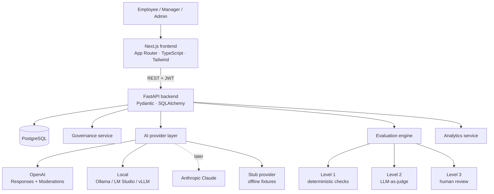
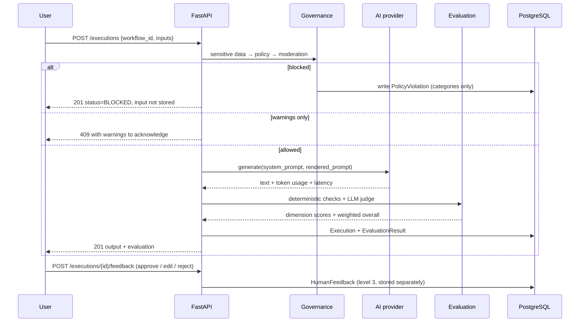

# Architecture

## System shape



## Request path for one execution

Nothing reaches a model provider until every enabled blocking control passes.



## Layout

```
backend/app/
├── api/routes/      HTTP surface only: validation, auth, serialisation
├── core/            config, database, security, enums, paths
├── models/          SQLAlchemy ORM
├── schemas/         Pydantic request/response contracts
├── repositories/    queries, including role scoping
├── services/
│   ├── ai/          provider interface, OpenAI, stub, pricing
│   ├── evaluation/  deterministic, judge, scoring, engine
│   ├── governance/  PII detection, policy pipeline
│   └── analytics/   adoption, quality, cost, version comparison
├── seed.py          demo dataset generator
└── benchmark.py     evaluation-case runner
```

## Design decisions

**Python and FastAPI rather than Node for the backend.** The work here is
evaluation and data analysis, which is where Python's ecosystem is strongest.
FastAPI generates the OpenAPI schema from the same Pydantic models the code
enforces, so `/docs` cannot drift from the implementation.

**A provider interface, not scattered SDK calls.** Every model call goes through
`AIProvider`. No route, repository or evaluator imports a vendor SDK. Adding
Anthropic Claude is a subclass and a factory entry, and the evaluation history
stays comparable because cost, latency and token counts are recorded against a
named provider and model.

**Providers declare capabilities; governance reads them.** Providers are not
interchangeable in the ways governance cares about — one keeps data in-house but
cannot moderate, another moderates well but is an egress of data. So each
declares `max_data_classification`, `supports_moderation` and
`keeps_data_in_house`, and the policy engine reads those declarations instead of
testing for vendor names. `LocalProvider` also proves the abstraction is real
rather than asserted: it speaks Chat Completions rather than the Responses API,
and describes JSON schemas in the prompt rather than enforcing them strictly,
because small models comply with the looser form far more reliably.

**Generation, evaluation and moderation are routed independently.**
`AI_PROVIDER`, `EVALUATION_PROVIDER` and `MODERATION_PROVIDER` are separate
settings, and a workflow version can pin its own provider. That is what makes
"generate on a self-hosted model, moderate and judge elsewhere" a configuration
rather than a fork.

**A stub provider in the box.** `AI_PROVIDER=stub` returns deterministic
fixtures derived from the input. The entire platform — execution, governance,
evaluation, analytics — runs with no API key and no spend, which is what makes
`docker compose up` a real demo rather than a login screen. The stub ignores the
system prompt, so it cannot be used to compare prompt versions; the benchmark
runner says so explicitly when it is active.

**Prompts are versioned, never overwritten.** An execution points at a
`workflow_version`, so a quality number is always attributable to the exact
prompt that produced it. This is the difference between "I improved the prompt"
and evidence.

**String UUIDs and generic JSON columns.** The same schema runs on PostgreSQL in
production and SQLite in the test suite, so tests need no services and stay fast
enough to run on every commit.

**Role scoping lives in the repository layer, not in the UI.** Employees see
their own executions, managers see department aggregates rather than colleagues'
raw prompts, admins see everything. Hiding a nav item is not access control.

## What production would need that this does not have

- SSO (Entra ID / Okta) instead of local JWT, with SCIM for the user directory
- Streaming responses, and a job queue for long-running benchmarks
- Per-tenant isolation; the organisation table exists but is single-tenant here
- Real DLP instead of pattern matching, and log redaction at the sink
- Rate limiting and per-department budget enforcement
- A prompt approval workflow, so publishing a version is not a single admin action
